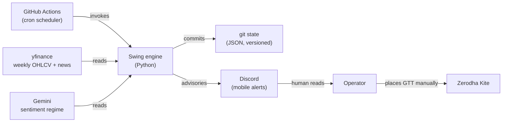
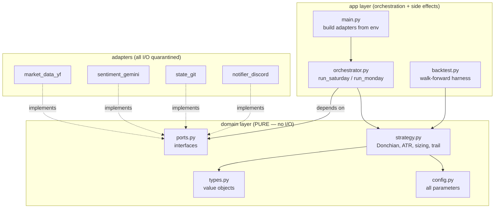
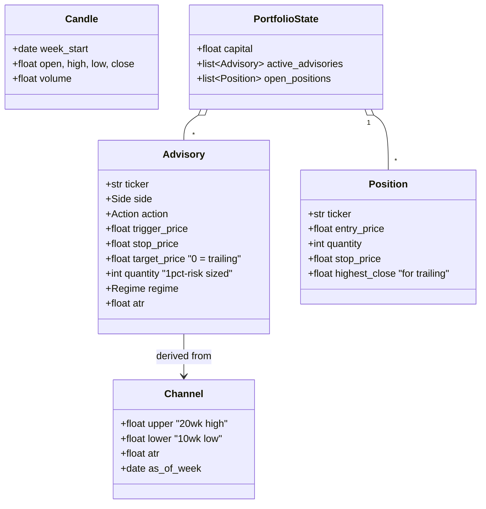
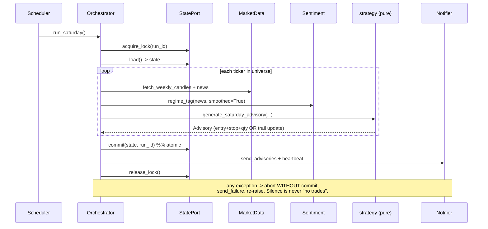
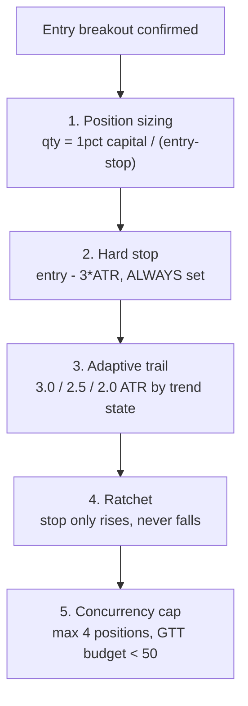

# Architecture & audit reference — NSE swing engine v2

This document is written for **third-party AI audits before production deployment**.
It describes the system precisely enough that another agent can verify the risk
controls, data-flow integrity, and separation of concerns without running the code.
All UML uses Mermaid, which GitHub renders natively.

## 1. System context

An advise-only engine. It never holds broker credentials; a human executes every
order on Zerodha Kite. Two scheduled GitHub Actions runs per week produce Discord
advisories.

Trust boundary: everything left of the operator is automated and holds NO money
or broker access. The operator is the only actor who can move capital.

## 2. Layered architecture (ports & adapters)

The domain layer is pure (no I/O, no vendor imports) and is the only place trading
math lives. Adapters quarantine all I/O. This is what makes the engine auditable:
the risk logic can be read and unit-tested in isolation.

**Audit checkpoint:** `strategy.py` and `config.py` import only `statistics`,
`datetime`, and sibling domain modules. If either imports pandas, yfinance,
google, or os, the purity guarantee is broken. Verify with:
`grep -E "import (pandas|yfinance|google|os|requests)" src/swing_engine/domain/*.py`
(should return nothing).

## 3. Domain class model

## 4. Saturday run sequence

## 5. The risk framework (the core of the audit)

Five independent controls, each verifiable in isolation:

| # | Control | Where | Failure it prevents |
|---|---|---|---|
| 1 | 1%-risk sizing | `position_size()` | Oversized position blows up account on one loss |
| 2 | ATR hard stop | `hard_stop_price()` | Naked position riding a crash to zero (v1's fatal flaw) |
| 3 | Adaptive trail | `choose_trail_multiple()` | Giving back all open profit / exiting too early |
| 4 | Upward-only ratchet | `generate_saturday_advisory` | Loosening a stop under pressure (emotion) |
| 5 | Concurrency cap | `max_open_positions` | Correlated cluster of positions = hidden leverage |

**Audit checkpoint:** every entry Advisory with `action == PLACE_GTT` must have
`stop_price > 0`, `quantity > 0`, and `stop_price < trigger_price`. There is no
code path that emits a sized entry without a stop.

## 6. Technology-lens risk controls

| Risk | Guard |
|---|---|
| Silent API failure | Top-level try/except aborts without commit, fires Discord `send_failure`, re-raises (non-zero exit fails the Action visibly). |
| Missed run (dead engine) | `send_heartbeat` on success arms a dead-man's switch; absence of the green ping is the alarm. |
| Look-ahead bias | Backtest computes channel from `candles[:t]`, evaluates on `candle[t]`. Test `test_backtest_has_no_lookahead` asserts every exit week > entry week. |
| Still-forming candle | yfinance adapter drops any bar whose week hasn't closed (Fri + buffer). |
| Concurrent runs | git lockfile lease with 30-min TTL; `concurrency` group in the workflow. |
| Secret leakage | Secrets only via env in `main.py`; `.gitignore` blocks `.env`; GitHub Actions secrets never printed. |
| State corruption | Atomic temp-file replace + single git commit = all-or-nothing; commit log is a free audit trail. |
| Stale GTT after corporate action | Kite auto-cancels on ex-date; Saturday run detects the missing position and re-advises. |

## 7. Overfitting / data-snooping defenses

- Parameters are **fixed priors from literature** (Chandelier 3.0 ATR / 22-period,
  Donchian 20), not grid-searched over the ~156 weekly bars available.
- Sentiment is a **coarse 3-state tag**, not a calibrated numeric multiplier — an
  LLM's fine-grained score is not trustworthy enough to size trades on.
- Backtest reports **buy-and-hold benchmark** alongside strategy return, so
  under-performance can't hide behind a positive absolute number.
- **Known limitation stated plainly:** the bundled synthetic backtests use
  Brownian motion (zero autocorrelation) and therefore validate risk *mechanics*
  only — they cannot demonstrate a trend edge. Real-data walk-forward via
  `run_backtest` across a full bull+bear cycle is mandatory before live use.

## 8. What an auditing agent should check

1. Domain purity (grep in section 2).
2. Every sized entry carries a stop (section 5).
3. No look-ahead (run `pytest -k lookahead`).
4. Secrets never committed (`git log -p | grep -i "api_key\|webhook"` returns nothing).
5. Failure path commits nothing (read `orchestrator._abort`).
6. Real-data backtest was actually run and reviewed (not just synthetic).
7. Parameters in `config.py` match the values claimed here (no silent drift).
